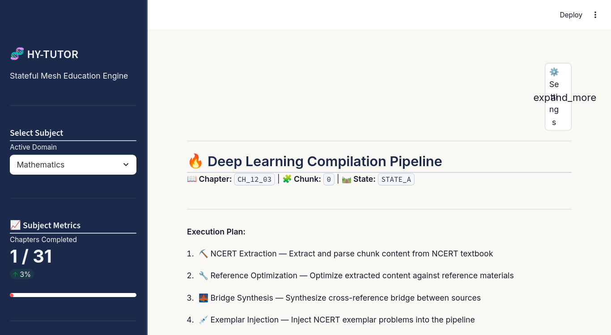

# HY-TUTOR: AI-Driven Socratic Study Engine

<p align="center">
  
</p>

<p align="center">
  <a href="https://www.python.org/downloads/"></a>
  <a href="LICENSE"></a>
  <a href="https://aistudio.google.com/app/apikey"></a>
  <a href="#-status"></a>
</p>

A **Multi-stage content-compilation + adaptive-tutoring pipeline** for Class XI/XII STEM subjects (Physics, Chemistry, Mathematics, Biology), wrapped in a Streamlit web app.

> 📝 [Changes](#-changes) · 🐛 [Bug Fixes](#-bug-fixes) · 🩺 [Known Bugs](#-known-bugs-prevalent) · 🚧 [Future Upgrades](#-future-upgrades-planned) · 🤖 [AI Use](#-ai-use-disclosure)

---

## 🤖 AI Use Disclosure

This project was developed with **significant assistance from AI tools (large language models)**. With all due respect, we acknowledge the role AI has played:

- **Pipeline debugging** — diagnosing API failures, recovery from JSON-decode errors, race conditions in subprocess orchestration
- **Architectural refactors** — per-chapter folder model, per-subject workspace isolation, per-subject ChromaDB vector store
- **Code generation** — ChromaDB integration, the auto-update + pip-install flow, the `index_active_chunk()` helper, the `read_pdf_text` removal, the multi-file concatenation helper


All **architectural decisions, code review, and final integration** were performed by the human maintainer. AI was an amplifier of the maintainer's intent, not a replacement for it. 

---

## 📋 Table of Contents

- [🤖 AI Use Disclosure](#-ai-use-disclosure)
- [🎯 What is HY-TUTOR?](#-what-is-hy-tutor)
- [✨ Key Features](#-key-features)
- [🎨 Looks](#-looks)
- [🚀 Quick Start](#-quick-start)
- [🧠 LLM Strategy](#-llm-strategy)
- [🏗 Architecture](#-architecture)
- [📚 Pipeline Commands](#-pipeline-commands)
- [🎨 UI Features in Detail](#-ui-features-in-detail)
- [📝 Changes](#-changes)
- [🐛 Bug Fixes](#-bug-fixes)
- [🩺 Known Bugs (Prevalent)](#-known-bugs-prevalent)
- [🚧 Future Upgrades Planned](#-future-upgrades-planned)
- [🛠 Troubleshooting](#-troubleshooting)
- [🤝 Contributing](#-contributing)
- [📄 License](#-license)
- [🙏 Acknowledgements](#-acknowledgements)

---

## 🎯 What is HY-TUTOR?

HY-TUTOR is **not** a generic chatbot. It is a **compilation pipeline** that:

1. **Ingests** CBSE syllabus guidelines, NCERT textbooks, reference manuals, and exemplar problems (multi-file `.md` / `.txt` uploads).
2. **Compiles** structured lesson content through a DAG of pipeline stages (Blueprint → Miner → Optimizer → Bridge → Injector → Forge → Compile-Notes).
3. **Tutors** students through Socratic dialogue with pacing shields, prerequisite gating, and a 3-state edge router.
4. **Tracks** mastery, weak areas, and study time per chapter per subject.

The end result is a NotebookLM-style **split-screen learning dashboard**: lesson Markdown on the left (55%), Socratic chat on the right (45%), with a "Similar Problems" semantic-search panel below.

---

## ✨ Key Features

- **Multi-subject isolation** — Physics, Chemistry, Mathematics, Biology each get their own workspace, tracker, UI session, and ChromaDB store under `data_library/subject_workspaces/<subject>/`.
- **First-run wizard** — if `GEMINI_API_KEY` is missing, an in-browser panel collects and validates the key (no need to leave the app on first launch).
- **Multi-file upload** — every upload slot accepts multiple `.md` / `.txt` files; they are concatenated into one canonical file with `--- filename ---` markers so the LLM can see boundaries.
- **3-state edge router** — `STATE_A` (clear path) / `STATE_B` (prerequisite block with conversational override) / `STATE_C` (weak-area review).
- **Real-time pipeline runner** — DAG visualisation with per-command status badges, re-run buttons, and a 10-category error-diagnosis engine (rate limits, SSL, missing key, timeouts, etc.).
- **Recovery panel** — retry / skip / restart / clear for failed chunks.
- **Per-subject ChromaDB** — semantic "Similar Problems" search with difficulty-tier filters (Easy / Medium / Hard), wired to C5.5 (problems) and C5 (lesson sections).
- **Interactive syllabus review & edit** — chat with the "Architect" LLM to refine the master syllabus before locking it in.
- **Per-chunk navigation** — Previous / Reset / Exit on the learning dashboard, with per-chunk re-compile on demand.
- **Update checker** — Settings → About tab shows version status with a colored pill badge, plus a one-click "Update & install now" flow that handles `pip install -r requirements.txt` automatically.
- **Subject metrics sidebar** — chapters-completed %, weak-area flags, and per-subject isolation.
- **Scholarly-ink theme** (NotebookLM-inspired) with custom CSS, dynamic accent and background colour pickers, and popover-based settings.
- **Cross-platform** — Linux and Windows installers, with desktop-icon and Start-Menu integration.(Mac-OS platform availibilty slated for future)

---

## 👀 Looks

### 1. System Configuration Mode (multi-file syllabus upload)
📂 [`screenshots/01-syllabus-upload.png`](screenshots/01-syllabus-upload.png)

The first screen a new user sees. The Subject Metrics sidebar reports chapters-completed (e.g. `1 / 31`, `3%`). The main panel shows the four mandatory upload slots (CBSE Syllabus Guidelines, NCERT TOC, Reference Book TOC, Exemplar + Question Bank) — each accepting multiple `.md`/`.txt` files. Submitting triggers `command_0_syllabus.py` and transitions to the Syllabus Review state.

### 2. Syllabus Review & Edit (Architect chat)
📋 [`screenshots/02-syllabus-review.png`](screenshots/02-syllabus-review.png)

The Master Syllabus is rendered as a vertical list of chapter expanders (e.g. `CH_11_01: Sets`, `CH_11_02: Relations and Functions`, `CH_11_03: Trigonometric Functions`) each showing cross-grade prerequisites, atomic chunks with competitive-focus badges, core milestones, and execution-profile flags. Below the chapter list sits the "Architect Modification Chat" — a textarea + send button that calls `command_0_1_editor.py`. A "✅ Confirm Syllabus & Proceed" primary button at the bottom locks the syllabus.

More screenshots to come as the project stabilizes — the Deep Learning Compilation Pipeline (DAG with per-command status badges) and Socratic Learning Dashboard (split-screen lesson + chat) are next.

---

## 🚀 Quick Start

### Requirements
- **Python 3.10+** (3.11 recommended)
- **Google Gemini API key** — [get one free here](https://aistudio.google.com/app/apikey)
- **4 GB+ RAM** and a modern browser
- **No GPU required** — Gemini runs in the cloud

### Linux 

```bash
# 1. Clone the repo
git clone https://github.com/AdityaK181225/HY-TUTOR.git
cd HY-TUTOR

# 2. Run the one-shot installer
bash install.sh

# 3. (Optional) Add the desktop icon — appears in your app menu and on your Desktop
bash make_desktop.sh

# 4. Launch
bash launch_engine.sh
```

### Windows (PowerShell)

```powershell
# 1. Clone the repo
git clone https://github.com/AdityaK181225/HY-TUTOR.git
cd HY-TUTOR

# 2. Run the one-shot installer
powershell -ExecutionPolicy Bypass -File .\install.ps1

# 3. (Optional) Add a desktop + Start Menu shortcut
powershell -ExecutionPolicy Bypass -File .\make_desktop.ps1

# 4. Launch
.\launch_engine.bat
```

Your browser will open `http://localhost:8501` automatically.

### What the installer does
1. Detects Python 3.10+ (or guides you to install it)
2. Creates a `.venv/` virtual environment
3. Installs all `requirements.txt` packages
4. Seeds `config/.env` from `config/.env.example`
5. Prompts (masked) for your Gemini API key and saves it to `config/.env`
6. Validates the key format (`^AIza[A-Za-z0-9_-]{30,50}$`)

If you skip the key prompt, the in-app **First-Run Wizard** will collect it when Streamlit first loads.

---

## 🧠 LLM Strategy

| Tier | Model | Role | Where |
|------|-------|------|-------|
| Cloud | Google Gemini (`gemini-...`) | Heavy reasoning, content generation, tutoring, syllabus editing | Cloud |

The pipeline uses a **model-fallback chain** in `core_pipeline/utils/inference.py` so that transient 5xx errors or rate limits automatically rotate to the next available model.

---

## 🏗 Architecture

```
HY-TUTOR/
├── config/                          # Environment config (.env)
├── core_pipeline/                   # All pipeline commands (do not edit casually)
│   ├── command_0_syllabus.py        # Syllabus builder (4-source, domain-adaptive)
│   ├── command_0_1_editor.py        # Syllabus editor (LLM-powered, robust JSON parser)
│   ├── command_0_5_router.py        # Edge router (3-state machine: A/B/C)
│   ├── command_1_blueprint.py       # Blueprint generator (chunk planning + per-chunk files)
│   ├── command_2_miner.py           # NCERT verbatim extraction (single-block prompt)
│   ├── command_3_optimizer.py       # Reference manual processing (5000-word windows)
│   ├── command_4_bridge.py          # NCERT ↔ Reference cognitive linking
│   ├── command_5_forge.py           # Unified Lesson synthesis (LaTeX-rich) + index
│   ├── command_5_5_injector.py      # Exemplar problem extraction + ChromaDB indexing
│   ├── command_6_tutor.py           # Socratic dialogue engine
│   ├── command_7_ledger.py          # Session scoring + tracker updates
│   ├── command_8_compile_notes.py   # Per-chapter notes.md compiler (Phase 2)
│   ├── orchestrator.py              # DAG execution engine + archive copy step
│   └── utils/                       # Shared infrastructure
│       ├── paths.py                 # Per-subject SubjectPaths dataclass
│       ├── vector_db.py             # Subject-aware ChromaDB manager
│       ├── genai_client.py          # Gemini API client with model-fallback
│       ├── inference.py             # LLM invocation wrapper
│       ├── embedding_utils.py       # Compressed embedding helpers
│       ├── file_utils.py            # Multi-format text readers
│       ├── recovery.py              # Failed-chunk recovery manager
│       ├── update_checker.py        # Git + pip auto-update
│       ├── usage_tracker.py         # Per-chapter usage metrics
│       └── logging_utils.py
├── interface/                       # Streamlit UI
│   ├── app.py                       # Main app (state machine)
│   ├── assets/custom_style.css      # NotebookLM-inspired theme
│   └── components/                  # Sidebar, chat box, lesson viewer, wizard, …
├── data_library/                    # All data artifacts (per-user state, raw uploads, vector DB)
├── install.sh / install.ps1         # One-shot installers
├── launch_engine.sh / .bat          # Launchers
├── make_desktop.sh / .ps1           # Desktop-icon installers
├── requirements.txt
├── hytutor_main.png                 # Project logo / desktop icon
└── README.md
```

> The `docs/` directory is git-ignored. The detailed per-phase change-log plans (`CHANGES_PHASE_*.md`) and the unfixed-bug list (`KNOWN_BUGS.md`) live there as local working notes; only the public-facing summaries ship in this README.

---

## 📚 Pipeline Commands

| Stage | Command | Purpose |
|-------|---------|---------|
| 0 | Syllabus Builder | Synthesizes 4 source TOCs into a domain-adaptive syllabus |
| 0.1 | Syllabus Editor | LLM-powered edits with robust JSON extraction (3-stage parser) |
| 0.5 | Edge Router | 3-state machine: `STATE_A` (clear), `STATE_B` (prereq block), `STATE_C` (weak-area) |
| 1 | Blueprint | Plans milestone-aligned atomic chunks + writes per-chunk files |
| 2 | Miner | Verbatim NCERT extraction (one continuous VERBATIM_THEORY + supplementary LATEX_FORMULA) |
| 3 | Optimizer | Reference manual processing with 5000-word windows |
| 4 | Bridge | NCERT ↔ Reference cognitive linking, competitive shortcuts |
| 5 | Forge | Unified Lesson Markdown synthesis (LaTeX-rich) + ChromaDB index |
| 5.5 | Injector | Exemplar problem extraction + ChromaDB indexing |
| 6 | Tutor | Socratic dialogue with pacing shields + tier classification |
| 7 | Ledger | Session scoring, mastery tracking, chapter transitions |
| 8 | Compile-Notes | New (Phase 2). Compiles per-chapter `lesson/chunk_*.md` → `notes.md` |

---

## 🎨 UI Features in Detail

### State machine (`interface/app.py`)

```
[no syllabus]  →  System Configuration Mode
        ↓ (Command 0 succeeds)
SYLLABUS_REVIEW  →  Architect chat + ✅ Confirm
        ↓
SELECTION  →  Pick chapter, "Run Pre-Flight Triage"
        ↓
TRIAGED  →  STATE_A (Upload chapter assets) | STATE_B (Prereq override) | STATE_C (Weak-area)
        ↓
PIPELINE_RUNNING  →  DAG runner with per-node re-run
        ↓
LEARNING  →  Split-screen lesson + chat + similar problems
```

### Per-component highlights

- **`sidebar.py`** — domain switcher, per-subject metrics (chapters completed %, weak-area flags). State is pinned to disk per subject.
- **`chat_box.py`** — per-chunk chat history, writes to `chapter_cache/active_session_history.json` (per-subject).
- **`lesson_viewer.py`** — renders `Unified_Lesson.md` with LaTeX, resolves path via `SubjectPaths.chunk_paths()["lesson"]`.
- **`similar_problems.py`** — ChromaDB semantic search with Easy/Medium/Hard filter, attributed to `chapter_id` and `subject` in metadata.
- **`pipeline_runner.py`** — DAG view, status badges, **10-category error diagnosis engine** (rate limit, SSL, missing key, timeouts, missing files, etc.), per-node "🔄 Re-run" with cleanup-then-execute.
- **`recovery_panel.py`** — for failed chunks: retry / skip / restart / clear.
- **`settings_panel.py`** — popover with tabs: **Appearance** (theme, accent, background), **Update** (version status + Update & install), **About** (project info, vector-DB management).
- **`first_run_wizard.py`** — runs *before* `st.set_page_config`; collects and validates the Gemini API key in-browser with regex validation.

---

## 📝 Changes
### [v1.$\alpha$.0] — 2026-06-08 — FIRST STABLE RELEASE
- many bug fixes and patches present in previous dev editions
- change from single flat acctive_workspace to dynamic per subject workspace
- requirements installer package and setup
for windows and linux 
- API key can now be entered
- multiple SDK backend wiring has been completed (slated to become active via tab 1 of settings in the future upgrades)
- PDF inputs were a hanging pseudo-dead code thus have been removed temporarily for program optimization. Will be added soon
**( Kindly use marker-pdf/similar to convert your pdf to markdown. Suggested method is to use google collab or similar to run marker-pdf and convert)**

### [v1.$\alpha$.1] — 2026-06-09 — FIRST-RUN WIZARD + LAUNCH FIXES
- **First-run wizard redesigned** — now shows only once (when `GEMINI_API_KEY` is missing), with a highlighted link to obtain a free key from Google AI Studio. After saving the key, a single click takes the user straight to the main dashboard.
- **Launch engine graceful degradation** — `launch_engine.sh` and `launch_engine.bat` no longer abort when `GEMINI_API_KEY` is empty; they warn and let Streamlit start so the in-app wizard can handle key setup.
- **Sidebar expand button** — fixed the hamburger icon not rendering when the sidebar is closed (corrected `data-testid` selector in `custom_style.css`).
---

## Bug Fixes

> Bug entries the maintainer has fixed in the codebase. Each entry includes the symptom, the root cause, and what the fix was.

### Bug #002 — Launch engine aborts when GEMINI_API_KEY is empty ✅ Fixed (2026-06-09)

**Severity:** High (blocks first launch entirely)
**Area:** `launch_engine.sh`, `launch_engine.bat`

**Symptom**
After a fresh clone + `install.sh`, running `bash launch_engine.sh` would print a fatal error and exit before Streamlit ever started, even though the in-app First-Run Wizard was designed to collect the key.

**Root cause**
`launch_engine.sh` and `launch_engine.bat` both performed `exit 1` when `GEMINI_API_KEY` was empty, preventing Streamlit from launching. The in-app wizard never got a chance to run.

**Fix**
Changed the empty-key check from a fatal exit to a warning. Streamlit now starts regardless, and the First-Run Wizard handles key setup.

### Bug #003 — Sidebar expand button not visible when sidebar is closed ✅ Fixed (2026-06-09)

**Severity:** Medium (UI usability)
**Area:** `interface/assets/custom_style.css`

**Symptom**
When the sidebar was collapsed, the expand button (hamburger icon) was not visible or showed raw `keyboard_double_arrow_right` text instead of the styled hamburger icon.

**Root cause**
The CSS targeted `button[aria-label="Open sidebar"]` but the actual expand button has `data-testid="stBaseButton-headerNoPadding"` with an empty `aria-label`. The selectors never matched.

**Fix**
Updated all sidebar-toggle CSS selectors to use the correct `data-testid="stBaseButton-headerNoPadding"` and `data-testid="stExpandSidebarButton"` selectors. Both the open and closed states now render a consistent ink-blue pill with three white hamburger lines.

### Bug #000 — Syllabus Editor crashes on chat-style prompts ✅ Fixed (2026-05-06)

**Severity:** Medium (UX crash)
**Area:** `core_pipeline/command_0_1_editor.py`, `interface/app.py`

**Symptom**
When the user typed a chat-style question (e.g., "hi there do u think the syllabus is good enough?") into the **Architect Modification Chat** textarea and pressed submit, the syllabus editor subprocess crashed with:

```
Command '['python3', 'command_0_1_editor.py', 'Mathematics', '…'] returned non-zero exit status 1.
```

**Root cause**
1. The Gemini API returned a response that contained prose + attempted JSON (the model treated a chat question as a conversational request rather than a structural modification).
2. `json.loads()` failed on the prose-wrapped response → `JSONDecodeError` → `sys.exit(1)`.
3. The caller in `app.py` passed the un-stripped `st.text_area` value (which could contain a trailing `\n`), compounding the issue.


---

## Known Bugs (Prevalent)

> Unfixed bugs identified before the first public release. Each entry includes the symptom, the suspected root cause, and a suggested fix. **Contributors are welcome to pick one of these and submit a PR.**

### Bug #001 — Preset colour swatches in Settings → Appearance don't apply

**Severity:** Low (cosmetic / workflow)
**Status:** Unfixed
**Area:** `interface/components/settings_panel.py`

**Symptom**
In the **Settings → Appearance** tab, clicking a preset colour swatch (e.g. "Forest Green" under Accent Color, or "Parchment" under Background Color) does not change the dashboard appearance. The colour picker (palette box) doesn't update to reflect the selected preset either.

The palette *does* work when clicked directly — the dashboard updates instantly. Only the one-click preset buttons are broken.

**How to reproduce**
1. Open the app and click the ⚙️ Settings popover
2. Go to the **Appearance** tab
3. Under **Accent Color**, click any preset swatch (e.g. "Forest Green")
4. Observe: nothing changes — the accent stays "Ink Blue"
5. Click the colour picker (square palette) directly and pick a new colour
6. Observe: the dashboard updates immediately


## 🚧 Future Upgrades Planned

> Work that has been identified as needed but is not yet scheduled. Items here are scoped well enough to act on; the order is roughly the maintainer's priority.

### Primary upgrade plans

- **🔁 Re-implement PDF intake** — The legacy `read_pdf_text` 3-tier fallback (PyPDF2 / pdfminer.six / empty-string) couldn't handle equation-heavy CBSE PDFs cleanly. A proper re-implementation will use OCR fallback + equation/table preservation (target library: `marker-pdf` or similar). Until then, the in-app banner reads *"📌 PDF intake coming soon"*.
####
- **Add an images, diagrams and graphs section or window to facilitate visualization in important scenarios of STEM subjects**

### Secondary upgrade plans

- **Setup the AI modals and API key Tab in settings to move away from only Gemini based system to other providers as well(backend development under progress)**


- **📝 Wire `command_8_compile_notes.py` into the orchestrator** — Currently `notes.md` is generated on demand. Hook C8 into the orchestrator so it auto-fires when the last chunk of a chapter is marked `COMPLETED` in the tracker.


### tertiary upgrade plans

-- **🐛 Fix Bug #001 (preset colour swatches)**

- **🌐 Multi-language syllabus support** — Hindi, regional-language textbook support.

- **📊 Richer progress dashboard** — Charts (mastery over time, weak-area heatmap, study-time per chapter) using Plotly.
- **🔌 Pluggable vector-DB backend** — ChromaDB is hard-coded in `vector_db.py`. A backend abstraction would let users swap in FAISS, Qdrant, or Weaviate without code changes.
- **📦 Offline / cached-mode LLM** — Cache LLM responses per (subject, chapter_id, chunk_index) to avoid re-generating expensive lesson synthesis if the user navigates away and back.
- **🧭 Improved prerequisite graph visualisation** — The 3-state router resolves the next chapter but doesn't show *why*. A small graph view would let students see the prerequisite chain at a glance.

---

## 🛠 Troubleshooting

- **"ModuleNotFoundError" on launch** — your `.venv` is missing. Run `bash install.sh` (Linux/macOS) or `.\install.ps1` (Windows).
- **"GEMINI_API_KEY is empty"** — the launch engine now shows a warning and lets Streamlit start. The in-app **First-Run Wizard** will guide you through setting the key on first launch.
- **Streamlit doesn't open a browser** — manually visit `http://localhost:8501`.
- **Desktop icon doesn't show up on Linux** — your file manager may need a refresh, or you may need to right-click → "Allow Launching" on the file.
- **Windows: "running scripts is disabled on this system"** — prepend `powershell -ExecutionPolicy Bypass` to the command, as shown in the Quick Start above.
- **Chromadb install fails on Windows** — install [Visual Studio Build Tools](https://visualstudio.microsoft.com/downloads/?q=build+tools) and retry.
- **"No similar problems found"** in the Learning Dashboard — the ChromaDB index is per-subject and per-chunk. Run the full pipeline (C1 → C5.5) for the chapter first; indexing happens at the end of C5.5.
- **Pipeline fails with "rate limit"** — the model-fallback chain in `core_pipeline/utils/inference.py` rotates to the next model automatically. If all models are exhausted, wait 1–2 minutes and click the per-node "🔄 Re-run" button on the failed node.
- **`git pull` failed because of local changes** — the Settings → About "Update & install now" refuses to merge dirty trees. Stash or commit your local changes first.

---

## 🤝 Contributing

We welcome PRs! Here's how to get started:

1. **File an issue first** for any non-trivial change so we can discuss the approach.
2. **Pre-release bug list** — the [🩺 Known Bugs](#-known-bugs-prevalent) section above lists issues that are open for grabs. Pick one and submit a fix; we'll review and merge.
3. **Code style** — Python 3.10+, 4-space indent, LF line endings (enforced by `.editorconfig` + `.gitattributes`), follow the existing patterns in each module.
4. **Test before submitting**:
   ```bash
   python tests/test_imports.py    # 43 import tests
   python tests/test_vector_db.py  # 9 vector-DB tests
   ```
5. **Don't put public docs in `docs/`** — that directory is git-ignored. Anything that should be visible to GitHub visitors must live in this README or in source code.

**Repository etiquette**
- One PR per logical change.
- Reference the relevant section of this README (e.g., "Fixes Bug #001") in the PR description.
- For changes that touch `core_pipeline/`, run a live end-to-end run with a real Gemini key before requesting review.

---

## ✍️ A note from the author

Hey — if you're reading this, thank you for checking out HY-TUTOR.

I built this project over a long stretch of late nights, lots of debugging, and a lot of learning. I am now stepping back to focus on other things for a while — school, life, and frankly just giving myself a break from the screen for a bit.

Because of that, my activity on this repo is going to be **sporadic**. Please don't expect fast (or any) responses from me on issues or PRs. The project is in a working state, fully installable, and the community is welcome to take it in whatever direction makes sense.

- **Preferred contact: GitHub itself.** Open an issue, leave a PR comment, or use GitHub Discussions. Please prefer this over email.
- **For genuinely blocking or security-related matters only**, you can reach me at the Gmail address listed on my GitHub profile. Please be patient — I will try to respond, but no promises.

Thanks for reading this far. Take care of yourselves. 🙏

---

## 📄 License

HY-TUTOR is licensed under the **PolyForm Noncommercial License 1.0.0**.

- ✅ Free for: personal study, non-commercial educational use, internal
  research, open-source contributions, and any use that does not
  generate revenue.
- ❌ Requires a separate commercial license for: selling the software,
  hosting it as a paid service, embedding it in a commercial ed-tech
  product, or using it to provide paid tutoring services.

For commercial licensing inquiries, open a GitHub issue at
[AdityaK181225/HY-TUTOR/issues](https://github.com/AdityaK181225/HY-TUTOR/issues)
tagged `commercial-license`. The full license text is in
[LICENSE](LICENSE).

**Contributions** are accepted under the
[Developer Certificate of Origin 1.1](https://developercertificate.org/)
with an **Inbound=Outbound** clause (see [CONTRIBUTING.md](CONTRIBUTING.md)).
In short: by DCO-signing your commits, you grant the maintainer the
right to relicense your contribution under any license terms, current
or future, while you retain ownership and the right to use your own
code independently. A DCO-checking GitHub App (Probot DCO) blocks
PRs that aren't signed.

---

## 🙏 Acknowledgements

- **To My Mother**: My deepest gratitude goes to my mother. Thank you for being my anchor, my constant source of emotional support, and for keeping me fed and functional when everything else was falling apart. This would genuinely not have been possible without you.

- **To My Special Friends** : To my inner circle of close friends who kept me grounded. Thank you for listening to me vent, making me laugh, and reminding me that a life exists outside of this work.


- **To the Board** : I acknowledge the Examination Board for providing the official framework, guidelines, and deadlines that forced me to actually finish this project.

- **To the Severe Lack of Teaching facilities**: i would say that this era of edu becoming a business with lack of self learning oppurtunities has acted as a great motivation and inspiration for this project. By teaching everything to myself, I successfully became my own mentor, faculty, and emotional support system.

- **To the Corporate Giants and EdTech Conglomerates** : A nod to the massive, multi-billion-dollar educational platforms and IT giants. Thank you for dominating the internet with endless paywalls and marketing, which ultimately inspired me to ignore the noise and just figure things out on my own anyway.

- **To the Non-Contributors** : To the people who did absolutely nothing to help with this project—thank you. Your complete absence ensured that no one messed up my workflow, which turned out to be a brilliant form of accidental assistance.

- **To Everyone Who Adjusted to My Chaos**: Finally, a massive thank you to everyone who tolerated my chaotic schedule over the past few months. Thank you for forgiving my chronic lateness, understanding why I couldn't give you my time, and adjusting your own lives to fit my erratic availability. Your patience did not go unnoticed.

<p align="center">
  <sub>Built with care, an Asus TUF F15, Zorin OS 18.1, and a lot of coffee. ☕</sub>
</p>
